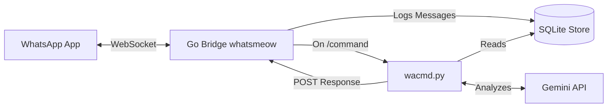

<div align="center">
  <h1>💬 wa-slash-commands</h1>
  <p><strong>An AI-powered Chief of Staff inside your WhatsApp group chats.</strong></p>
  
  <p>
    
    
    
  </p>
</div>

`wa-slash-commands` is a standalone, intelligent WhatsApp CLI integration that turns any WhatsApp chat into a productive workspace. It leverages a native Go bridge (`whatsmeow`) and the Google Gemini API to analyze conversations, extract rich insights, and respond to `/slash` commands directly in the chat.

## ✨ Features

- 🔒 **Owner-Protected**: Strict security checks ensure commands are *only* executed when sent by your personal phone number. Other group members typing `/commands` are silently ignored.
- 🧠 **AI-Powered Synthesis**: Powered by Gemini 1.5 with Strict JSON Schema Enforcement to guarantee structured, non-hallucinated responses.
- 📦 **Self-Contained**: Comes with an embedded, auto-compiling Go bridge. No complex external dependencies or webhooks required.
- ⚡ **Zero-Config Onboarding**: An interactive CLI wizard authenticates you via a simple QR code and auto-detects your identity.

## 🚀 Available Commands

Type these from your phone in any chat where the bridge is running:

| Command | Description | Time Window |
| :--- | :--- | :--- |
| `/sotu` | **State of the Union:** Identifies the group's purpose, big picture objectives, key themes, and decisions. | 30 Days |
| `/pending` | **Critical Open Loops:** Scans history to track ongoing initiatives and outputs actionable "Next Steps" with DRIs. | 30 Days |
| `/stats` | **Team Personas:** Analyzes participant activity and labels them with collaboration styles (e.g., *The Driver*, *The Lurker*). | 14 Days |
| `/recap` | **24h Timeline:** Extracts only critical signals and decisions from the past 24 hours, filtering out noise. | 24 Hours |
| `/eli5 <topic>` | **Explain Like I'm 5:** Context-aware search engine that explains a topic based strictly on what was discussed. | 30 Days |

---

## 🛠 Installation & Quick Start

**Prerequisites**: Python 3.10+ and Go 1.21+.

1. **Clone the repository:**
   ```bash
   git clone https://github.com/sameer-hoda/wa-slash-commands.git
   cd wa-slash-commands
   ```

2. **Install Python dependencies:**
   ```bash
   pip install -r requirements.txt
   ```

3. **Run the interactive setup wizard:**
   ```bash
   python3 setup.py
   ```
   *The wizard will prompt you for your Gemini API key, compile the native WhatsApp bridge, and display a QR code for you to scan via "Linked Devices" in WhatsApp.*

4. **Start the Bridge:**
   ```bash
   ./start.sh
   ```
   *Keep this running in a terminal session (e.g., via `tmux` or `screen`).*

---

## 🧪 Troubleshooting & API Tester

If commands like `/eli5` work but `/sotu` or `/recap` return fallback messages (e.g., "Analysis unavailable"), it usually means the chat history payload exceeded Gemini API limits or the schema was rejected.

We have included a diagnostic tool to verify your API key supports both standard text generation and strict JSON schema generation:

```bash
python3 test_api.py
```

Additionally, `wacmd.py` will print detailed logs to your terminal (payload size, earliest message pulled) whenever a command is invoked to help you debug context limits.

---

## 🏗 Architecture

The system is split into two seamless components:

1. **The Go Bridge (`./bridge`)**: Built on the highly stable `whatsmeow` library. It maintains the WebSocket connection to WhatsApp, intercepts incoming messages, and syncs chat history into a local SQLite database (`store/whatsapp.db` & `store/messages.db`).
2. **The Python Engine (`wacmd.py`)**: When the bridge detects a message starting with `/`, it shells out to `wacmd.py`. The Python script verifies the sender's identity, pulls necessary context from SQLite, executes a strictly typed Gemini API call, and sends the response back via the bridge's local HTTP API.



## 🛡 Privacy & Security

- **Local Storage**: All message history is stored locally in SQLite (`store/`). Nothing is sent to a cloud database.
- **Selective Processing**: Only messages required to fulfill a specific slash command are sent to the Gemini API.

## 📝 License

Distributed under the MIT License. See `LICENSE` for more information.
